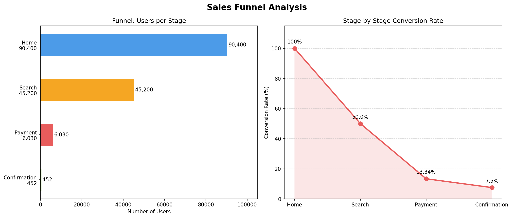

# AI-Assisted Sales Funnel Analysis

## Project Overview
This project analyzes user drop-off across a 4-stage e-commerce sales funnel 
using Python, Pandas, and Matplotlib. AI (Claude) was used to generate insights 
and support analysis interpretation.

**Dataset:** Sales Funnel Data – User Drop-off Analysis (Kaggle, by Andrew Jaya Satyo)  
**Tools:** Python · Pandas · Matplotlib · Google Colab · Claude AI

---

## Funnel Performance Summary

| Stage        | Users  | Conversion Rate | Drop-off Rate |
|--------------|--------|-----------------|---------------|
| Home         | 90,400 | —               | —             |
| Search       | 45,200 | 50.00%          | 50.00%        |
| Payment      | 6,030  | 13.34%          | 86.66%        |
| Confirmation | 452    | 7.50%           | 92.50%        |

**Overall funnel conversion: 0.50%** (90,400 → 452)

---

## Key Insights

### 1. Search → Payment is the critical drop-off point
86.66% of users who reached the Search page did not proceed to Payment. 
This is the single largest drop in the funnel and represents the highest 
priority for optimization. Possible causes include unclear CTAs, lack of 
trust signals, or friction in the transition from browsing to intent.

### 2. Payment → Confirmation drop-off signals checkout friction
92.50% of users who reached the Payment page did not complete their purchase. 
This suggests issues at the checkout stage — potentially unexpected costs, 
limited payment options, or a complex form experience.

### 3. Gender breakdown shows slight female advantage in conversion
Female users slightly outperformed male users at the Payment and Confirmation 
stages (Female: 241 confirmed vs Male: 211), despite near-equal entry numbers 
at the Home page.

---

## Recommendations

| Priority | Action | Target Stage |
|----------|--------|--------------|
| High | Add trust signals and clearer CTAs on Search page | Search → Payment |
| High | Simplify checkout flow, reduce form fields | Payment → Confirmation |
| Medium | A/B test product page layout by gender segment | Search |
| Low | Retargeting campaign for users who reached Payment but didn't convert | Payment |

---

## Visualizations

---

## Project Structure

├── funnel_analysis.ipynb
├── funnel_analysis.png
├── home_page_table.csv
├── search_page_table.csv
├── payment_page_table.csv
├── payment_confirmation_table.csv
└── user_table.csv
